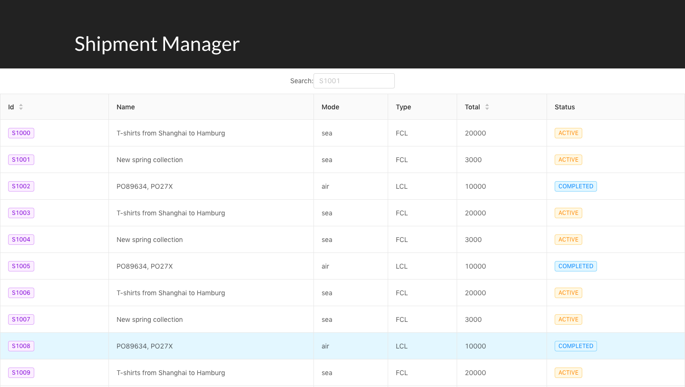

## Basic Overview

Built using React, Redux, Styled-components, Webpack.

## Available Scripts

In the project directory, you can run:

### `npm install`

installs dependencies and dev dependencies 

### `npm start`

Runs the app in the development mode. 
Open [http://localhost:3001](http://localhost:3001) to view it in the browser.

### `npm run build`

Builds the app for production to the `dist` folder

## Screens

